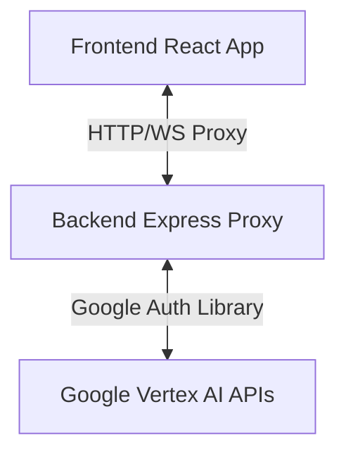

# RenderDrops // Core System

A professional development environment for running a Google Cloud Vertex AI Studio application. This project consists of a high-performance **React, Three.js, and Framer Motion frontend** coupled with a secure **Node.js/Express backend proxy** that negotiates API traffic with Google Cloud Platform.

---

## Architecture Overview



- **Frontend**: A React application utilizing Three.js/GSAP for 3D/particle visual rendering and Vite as the bundler.
- **Backend**: An Express proxy that resolves authentication, checks request integrity using header handshakes, enforces rate-limiting, and forwards request/response streams directly to Google Vertex AI.

---

## Project Structure

This project is configured as a multi-package repository using **npm Workspaces**. 

```
.
├── backend/                  # Node.js/Express Proxy API Server
│   ├── config/               # Configuration loading & validation
│   ├── middleware/           # Limiter and security middleware
│   ├── routes/               # Proxy HTTP & WebSocket routes
│   ├── utils/                # Auth token & regex helpers
│   ├── .env.example          # Template environment config
│   └── server.js             # Main server entrypoint
├── frontend/                 # React & Vite client application
│   ├── components/           # Navigation, footer, Three.js canvas
│   ├── pages/                # Pages and view components
│   └── vite.config.ts        # Vite build configuration
├── package.json              # Root package defining workspaces
└── README.md                 # System documentation
```

---

## Setup & Getting Started

### 1. Prerequisites

Make sure you have the following installed:
*   **Node.js** (v18 or higher recommended) and **npm**.
*   **[Google Cloud SDK / gcloud CLI](https://cloud.google.com/sdk/docs/install)**.

### 2. Google Cloud Authentication

Authenticate your local machine to call Google Cloud APIs with Application Default Credentials (ADC):
```bash
# Initialize and log in to gcloud CLI
gcloud init

# Authenticate for Application Default Credentials
gcloud auth application-default login
```

### 3. Environment Configuration

Copy the template env file inside the `backend` folder to configure your Google Cloud project details:
```bash
cp backend/.env.example backend/.env.local
```

Open `backend/.env.local` and define the following variables:
- `GOOGLE_CLOUD_PROJECT`: Your Google Cloud Project ID.
- `GOOGLE_CLOUD_LOCATION`: The location/region of your Vertex AI resources (e.g. `us-central1`).
- `PROXY_HEADER`: A random secret string used to sign requests from frontend shim to proxy.

### 4. Dependency Installation

Because we use **npm Workspaces**, you only need to run a single command in the root folder to install dependencies for the root, frontend, and backend packages:
```bash
npm install
```

### 5. Running the Application locally

Start both the frontend client and the backend proxy concurrently using the root dev script:
```bash
npm run dev
```

- **Frontend client** will be running at: `http://localhost:5173` (or the next available port).
- **Backend proxy** will be running at: `http://localhost:5005`.

---

## Available Scripts

From the root directory, you can run the following workspace scripts:

| Command | Description |
| :--- | :--- |
| `npm install` | Installs dependencies across root, backend, and frontend |
| `npm run dev` | Runs both frontend and backend development servers concurrently |
| `npm run dev-frontend` | Runs Vite dev server for the frontend workspace |
| `npm run dev-backend` | Runs Nodemon watch server for the backend workspace |

---

## Backend Security Features

- **Vertex AI Rate Limiting**: Backend is protected by rate limiting configuration (`express-rate-limit`) preventing unexpected GCP usage costs.
- **Shim Request Authentication**: Requests are signed using a proxy header handshake (`X-App-Proxy`) to ensure requests originate from the local application.
